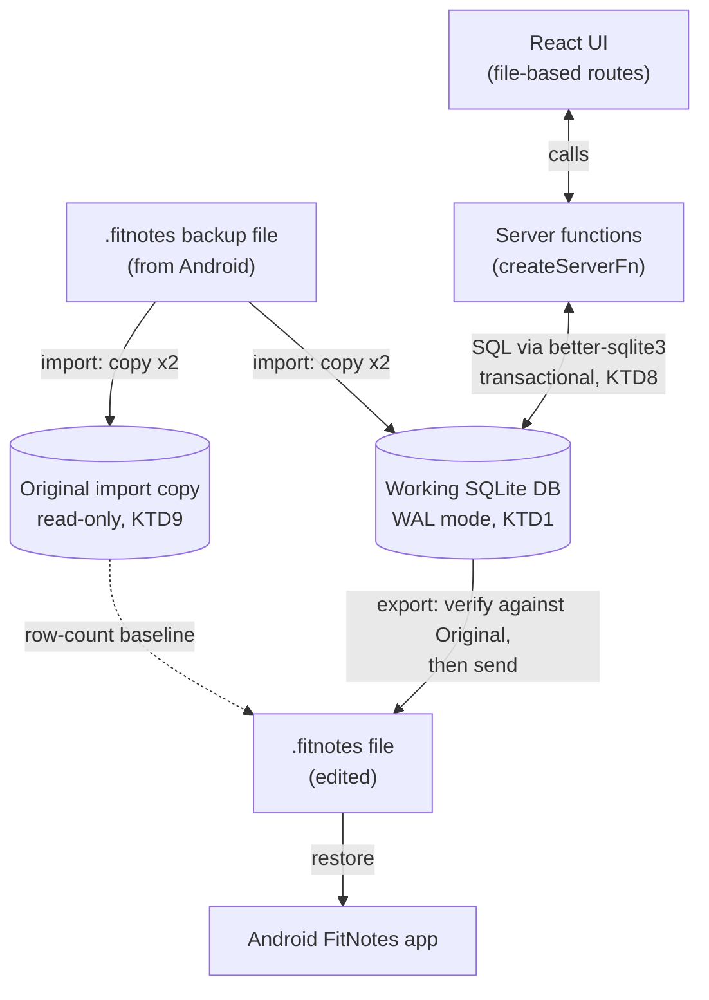

# FitNotes Exercise & Routine Editor - Plan

## Goal Capsule

- **Objective:** Ship a local-only personal web app that imports a FitNotes Android backup, provides a proper editor for exercises and routines, and exports a FitNotes-compatible backup for restoring back into the Android app.
- **Product authority:** Sole user/owner of the tool; personal-use decisions, no external stakeholders.
- **Execution profile:** Local development, single implementer, no deployment or hosting — the finished app is run with a local dev/start command on the owner's machine only.
- **Stop conditions:** Falsify KTD1 early, not late — U2 includes a manual round-trip smoke test (import, then restore the unedited working DB into the real Android app) before U3 starts, so the core architecture is confirmed or reassessed while only two units exist rather than after all five are built on it. If that smoke test or the final export (see Open Questions) fails to restore, stop and reassess the working-database export approach (KTD1) before continuing.
- **Tail ownership:** The user verifies, on their own device, that an exported backup actually restores successfully in the Android app before relying on this tool for real data changes.

## Product Contract

**Product Contract preservation:** This is the first implementation-ready pass on this document — R1-R8, the Key Decisions, Key Flows, and Acceptance Examples below are the same ones the requirements-only version of this plan established; planning did not revise product scope. The Planning Contract resolves the two items that requirements-only version deferred (exercise field scope, and delete-with-references behavior) via KTD4 and KTD5.

### Summary

A local web app that imports a FitNotes `.fitnotes` SQLite backup and gives its owner a proper editor for exercises (with categories) and routines (sections, exercises, target sets) — replacing the annoyance of doing this structural editing on the Android app. Edits export back into a FitNotes-compatible backup file that restores into the Android app.

### Problem Frame

FitNotes is an Android-only workout tracker. Editing and cleaning up the exercise list, and restructuring routines, is awkward on a phone screen — that friction is what's driving this rebuild, not dissatisfaction with day-to-day workout logging itself. The user isn't committed to fully replacing the Android app for live logging; that remains an open possibility, but isn't the reason this project exists.

### Key Decisions

- **Scope narrowed to exercises + routines, not the training log.** The pain point that motivated this project evolved during scoping from "editing workouts" broadly to specifically exercise-list cleanup and routine structuring. Workout/training-log history is explicitly out of v1.
- **One-time import, then export round-trip — no ongoing sync.** The web app seeds once from a backup file. Changes flow back to Android via export/restore rather than a live sync or repeated-import merge, which avoids conflict-resolution entirely.
- **Fresh web-native UI, not a mirror of Android screens.** Screens are designed for the editing use case (e.g. tables, bulk actions) rather than replicating mobile navigation, but keep FitNotes' terminology and groupings so the two apps stay easy to cross-check against each other.
- **Local-only, no authentication.** Runs on localhost for a single trusted user; no accounts, sessions, or access control.

### Requirements

**Import**

- R1. The app imports an existing `.fitnotes` SQLite backup as a one-time seed, loading exercises, categories, and routines (with their sections, exercises, and target sets) into the web app's data store.
- R2. Import retains all other data present in the backup (training log, body weight, goals, measurements, settings, and any other tables) even though the web app doesn't expose it, so that data survives unchanged through to export.

**Exercise management**

- R3. Users can view, add, edit, and delete exercises, including name and category assignment.
- R4. Users can view, add, edit, and delete categories used to group exercises, managed inline from the exercise list rather than a separate categories page. Category reordering is descoped (see Scope Boundaries) — categories keep whatever `sort_order` they already have.

**Routine management**

- R5. Users can view, add, edit, and delete routines, including their sections.
- R6. Within a routine section, users can add, edit, remove, and reorder exercises and their target sets.

**Export**

- R7. Users can export the current exercises, categories, and routines (as edited in the web app), merged with the untouched imported data, into a new `.fitnotes`-format SQLite file suitable for restoring into the Android app.

**Environment & access**

- R8. The app runs locally for a single trusted user; no authentication or multi-user access control is required.

### Key Flows

- F1. Import backup
  - **Trigger:** User supplies a `.fitnotes` SQLite backup file.
  - **Steps:** App reads the file, loads exercises/categories/routines into its own store, and retains all other tables' data as passthrough for later export.
  - **Outcome:** Web app is seeded with the user's real exercise and routine data.
  - **Covers:** R1, R2.

- F2. Export backup
  - **Trigger:** User requests an export after making edits.
  - **Steps:** App merges edited exercises/categories/routines with the passthrough data retained from import into a new SQLite file matching FitNotes' backup format.
  - **Outcome:** A `.fitnotes` file the user can restore into the Android app without losing training history or other untouched data.
  - **Covers:** R7, R2.

### Acceptance Examples

- AE1. Given a backup imported with training log entries referencing an exercise, when the user renames that exercise in the web app and exports, then the exported file's training log entries still reference the renamed exercise correctly and are neither dropped nor duplicated. Covers R2, R3, R7.
- AE2. Given a routine section with an ordered list of exercises and target sets, when the user reorders the exercises within that section and exports, then the exported sort order reflects the new order and every set stays associated with the correct exercise. Covers R6, R7.

### Scope Boundaries

**Deferred for later:**

- Training log / workout history, viewing or editing
- Body measurements, goals, graphs/analysis, calendar, personal records, comments, workout groups
- Rest timer, 1RM calculator, plate/barbell calculators
- Ongoing or repeated import with conflict resolution against edits already made in the web app
- Category reordering. The standalone categories page (with its move-up/move-down controls, KTD6) was collapsed into the exercise list once the exercise view grew a category sidebar/detail layout, and reordering didn't carry over — it wasn't worth the UI real estate on a page whose primary job is browsing exercises. Categories keep whatever manual order they already have; `sort_order` is still respected on read (the sidebar and groupings order by it), just no longer user-adjustable. Can be reintroduced later without a schema change if it turns out to matter.

**Outside this product's identity:**

- Multi-user accounts, authentication, or remote/hosted access — this is a single-user, local-only tool, not a hosted product.

### Dependencies / Assumptions

- Assumes the sample backup (`FitNotes_Backup_2024-05-29.fitnotes`) is representative of the current FitNotes schema; a backup from a different FitNotes app version could differ slightly.
- Assumes FitNotes' Android restore feature validates the SQLite file's structure closely enough that passthrough tables must be preserved faithfully, not merely present.

---

## Planning Contract

### Key Technical Decisions

- **KTD1 — Working database is an in-place edited copy of the imported backup**, using FitNotes' own schema rather than a separate app-specific data model. Import copies the uploaded file to a working location; all exercise/category/routine edits run as SQL against that same file. Export is then "hand back the current working file," not a merge step. This makes R2 (untouched tables survive) automatic by construction, since passthrough tables are never written to. Architecture review confirmed this is the right call for this shape of problem: the rejected alternative (a separate app-owned data model plus an export-time merge step) would have to re-derive FitNotes' full schema knowledge by hand to avoid silently dropping unmanaged-table data — a worse failure mode than anything the direct-edit approach risks. Two companion decisions harden it: the working DB is opened with `PRAGMA journal_mode=WAL`, and import validates `PRAGMA user_version` against the known-good value (22, per the sample backup) and fails loudly on mismatch rather than assuming a differently-versioned FitNotes export is compatible.
  - **WAL rationale, precisely:** WAL mode's actual purpose here is concurrency, not crash-safety — SQLite's default rollback-journal mode is _equally_ crash-safe (it recovers via a journal file instead of replaying committed WAL frames), and neither mode protects against filesystem/disk failure, since there's no second copy or replica involved. The reason to use it in a single-user app with no true concurrent users is that a single page load already fires overlapping reads (e.g. the exercises route loads exercises and categories via `Promise.all`), and router preloading or multiple tabs can add more. Rollback-journal mode would still be correct under that overlap, just serialized (readers/writer block each other); WAL lets them proceed concurrently at effectively no cost. So: adopted as cheap insurance against a real-but-minor case (overlapping requests), not a bug fix or a durability requirement.
- **KTD2 — Framework: TanStack Start (React), confirmed against current docs.** A single Vite-based app combining file-based UI routing (TanStack Router) with server-side "server functions" for all SQLite access, so there's no separate backend service to stand up or deploy. Routes live in `src/routes/` with a required `src/routes/__root.tsx` layout; the router is configured in `src/router.tsx` (an exported `getRouter()` factory); `routeTree.gen.ts` is generated, never hand-written. Scaffold via the current TanStack CLI (`@tanstack/cli`) rather than the older `create-tsrouter-app` entry point. TanStack Start is at Release Candidate stage (feature-complete, stable API) but ships multiple releases a day — pin an exact dependency version rather than a range, and re-check the scaffold command against current docs if implementation starts materially later than this plan.
- **KTD3 — SQLite access via `better-sqlite3`**, a mature synchronous native driver, called only from server functions. Confirmed: TanStack Start's server functions run in a Node.js runtime by default (file-system and native-module access, including `better-sqlite3`) unless the project opts into an edge deployment target (e.g. Cloudflare Workers) — this app does neither, so no runtime concern. Node's newer built-in `sqlite` module remains a lighter-weight alternative worth a quick look at implementation time if native-module install friction shows up, but isn't the v1 default.
- **KTD4 — Deletion guard, with an explicit reference table list.** Deleting an exercise or category blocks with an explanatory message, rather than cascading or silently orphaning references, if any reference exists. Because the source schema declares no `FOREIGN KEY` constraints anywhere, this guard _is_ the referential-integrity layer, not a UX nicety — so the reference set must be exhaustive and pinned, not illustrative. For a category: `exercise.category_id` (`NOT NULL`). For an exercise: `RoutineSectionExercise.exercise_id`, `training_log.exercise_id`, `Goal.exercise_id`, `WorkoutGroupExercise.exercise_id`, `ExerciseGraphFavourite.exercise_id`, `Barbell.exercise_id`, and `RepMaxGridFavourite.exercise_ids` — the last one stored as a comma-separated string, not a plain integer column, so it needs its own parse-and-check rather than a normal `WHERE exercise_id = ?`. **For a routine section (deleted via U4): `WorkoutGroup.routine_section_id` and `WorkoutGroupExercise.routine_section_id`** — doc review confirmed both reference `RoutineSection._id` with no FK constraint and have live rows in the sample backup (3 and 18 respectively), so a section delete needs the same guard as an exercise/category delete, not the exemption the Assumptions section originally claimed. This list is pinned to the schema version checked in KTD1 and needs re-verifying if that version guard ever needs to accept a newer schema. Resolves the field/behavior question this document previously deferred.
- **KTD5 — Exercise editing field scope.** Exposes `name`, `category`, `notes`, `weight_increment`, and (as of the exercise-type follow-up below) `exercise_type_id` as user-editable. The remaining technical fields (`default_rest_time`, `default_graph_id`, `weight_unit_id`, `is_favourite`) are still preserved as imported but not exposed for editing — they have no clear UI value for the exercise-cleanup use case and can be added later without a schema change. `_id` fields are never editable, which keeps this decision from colliding with KTD4's reference tracking.
  - **Exercise-type follow-up.** `exercise_type_id` was originally deferred here as a "technical field" with no documented meaning. It's since been reverse-engineered empirically: for every `exercise_type_id` value present in a real backup, correlate it against which `training_log` columns (`metric_weight`, `reps`, `distance`, `duration_seconds`) are ever non-zero across that id's logged sets — the same technique KTD-adjacent `src/lib/categoryColors.ts` used for `Category.colour`. That surfaced 7 distinct values in the sample backup (`Weight & Reps`, `Distance & Time`, `Time`, `Reps & Distance`, `Reps & Time`, `Reps Only`, plus a second `Time`-equivalent id the data can't distinguish from the first) — see `src/lib/exerciseTypes.ts` for the full derivation and the named constants. `exercise_type_id` is now an editable "Type" select in the exercise editor, defaulting new exercises to `Weight & Reps` (id 0, FitNotes' own default), and drives a "Tracks: ..." summary line so the editor reflects which fields that type actually records. This was also the reason target-set weight/reps inputs were pulled from routine editing (`routines/$routineId.tsx`) — that UI assumed every exercise was Weight & Reps, which this resolves the modeling gap for if target-set editing is reintroduced later (it should branch its inputs per `getExerciseTypeFields`, not assume weight+reps).
- **KTD6 — Reordering uses move-up/move-down controls**, not drag-and-drop, for routine-section exercises and target sets within a section. Keeps v1 dependency-light; drag-and-drop can be layered on later without an API or schema change. Originally also covered categories (via a dedicated categories page); that page was later collapsed into the exercise list and category reordering was dropped from scope in the process — see Scope Boundaries.
- **KTD7 — Styling via Tailwind CSS**, the common low-overhead pairing with TanStack Start starter projects; avoids hand-rolling a design system for a single-user tool.
- **KTD8 — Every multi-statement write runs inside one `better-sqlite3` transaction** (`db.transaction(fn)`), including KTD4's check-then-delete guard, cascading deletes (removing an exercise from a routine section must also remove its target sets), and batch reorders (updating `sort_order` across a section's rows). Data-integrity review flagged that, unwrapped, a crash or interrupted request between statements leaves the working DB in a valid-but-semantically-wrong state that would still pass a basic file check — this is the minimum-cost fix.
- **KTD9 — Import preserves the originally uploaded file untouched**, in a location separate from the working DB that's never opened for writes. This is the fallback if the working DB is corrupted by a bad edit or crash, and it's the baseline export's row-count verification (KTD1/U5) compares against.
- **KTD10 — Routine target sets removed from the UI; every section-exercise is hardcoded to "Copy previous workout."** `RoutineSectionExercise.populate_sets_type` is an undocumented FitNotes enum (no seed data, no strings anywhere in this schema) controlling how the mobile app pre-fills a workout started from a routine. `addExerciseToSection` now writes `populate_sets_type = 2` on every new row instead of relying on the column's default of `0`. The value `2` was inferred, not guessed: correlating a real backup's `RoutineSectionExercise` rows against whether they had any `RoutineSectionExerciseSet` target sets showed value `1` (41 rows) was 100% fully populated with target sets — consistent with a "use target sets" mode — while value `2` (43 rows) was 84% empty of target sets — consistent with "copy previous workout," which doesn't need template values since it pulls from `training_log` history at workout-start time. Applies going forward only; existing imported rows keep whatever value they already have (no backfill migration). Companion change: the weight/reps target-set editing UI (`addSet`/`removeSet`/`reorderSets` calls) was removed from `$routineId.tsx` — it only ever rendered a weight+reps form regardless of exercise type, which was already wrong for the non-weight exercises `exercise_type_id` distinguishes (modeling that field was deferred at the time), and copy-previous mode makes target sets moot for exercises created here anyway. The backend `addSet`/`updateSet`/`removeSet`/`reorderSets` functions and their tests are untouched, so type-aware set editing can be reintroduced later without an API change — exercise-type modeling now exists (see KTD5's follow-up and `src/lib/exerciseTypes.ts`), so a future reintroduction should branch its inputs per `getExerciseTypeFields` rather than assuming weight+reps.

### High-Level Technical Design

The working-database posture (KTD1) is the shape worth showing: both the UI and the export path read/write the same on-disk SQLite file, so nothing is serialized or merged at export time.

Passthrough tables (`training_log`, `BodyWeight`, `Goal`, `Measurement`, `settings`, etc.) sit in the same working DB file untouched by any server function — they ride along from import to export without the app ever reading or writing them. The original import copy (KTD9) never receives writes; it exists solely as a corruption fallback and as the row-count baseline export verifies against.

### Assumptions

- Deleting a routine or a routine-section-exercise does not need the same reference guard as KTD4 — unlike a routine _section_, they aren't referenced by other passthrough tables. (Doc review found routine _sections_ are referenced by `WorkoutGroup`/`WorkoutGroupExercise` with live data, so that case is now covered by KTD4 directly, not exempted here.)
- Upload size for the imported backup stays in the personal-use range (the sample backup is ~120KB; years of one person's training history is unlikely to reach even low tens of MB). TanStack Start's server functions currently buffer the full request body in memory with no framework-level size limit (confirmed open as of this writing — see Sources), so this assumption is load-bearing for U2 rather than enforced by the framework; U2 adds its own lightweight size sanity check rather than relying on one.

### Risks & Dependencies

- **TanStack Start's release cadence is very high** (multiple releases a day at RC stage) — pin an exact version in `package.json` rather than a caret range, and re-verify the scaffold/server-function API against current docs if implementation starts well after this plan was written.
- **Schema drift risk**: FitNotes is a third-party app the team doesn't control. The KTD1 `user_version` check catches an outright mismatch, but a same-`user_version` schema tweak (rare, but not impossible) could still slip through; treat any import validation failure as a signal to re-check the live schema before assuming a bug in this app.
- **No framework-level upload size limit** on server functions (see Assumptions) — acceptable for this tool's realistic file sizes, but worth knowing if the app is ever pointed at a much larger export.

---

## Implementation Units

### U1. Project scaffold

- **Goal:** Stand up a working TanStack Start (React + Vite) project with the base tooling this plan depends on.
- **Requirements:** R8 (local-only environment).
- **Dependencies:** None.
- **Files:**
  - `package.json`
  - `vite.config.ts`
  - `src/router.tsx`
  - `src/routes/__root.tsx`
  - `tailwind.config.ts` (or current TanStack Start + Tailwind convention)
  - `.gitignore`
  - `data/.gitkeep` (parent of `data/working.fitnotes` and `data/original-import.fitnotes`, KTD1/KTD9 — the directory is committed via `.gitkeep`, its database contents are gitignored)
- **Approach:** Scaffold with the current TanStack CLI (`@tanstack/cli`, not the older `create-tsrouter-app` entry point — KTD2), pinning an exact dependency version given the framework's fast release cadence. Add Tailwind (KTD7) and `better-sqlite3` (KTD3) as dependencies. Wire `npm run dev`, `npm run typecheck`, `npm run build`, and a test runner script (`npm test`) per the Verification Contract below. Server-only modules (the DB helper and server functions' internal logic) follow TanStack Start's `*.server.ts` naming convention, which the framework enforces at build time by excluding them from the client bundle.
- **Patterns to follow:** TanStack Start's own starter template structure for file-based routing (`src/routes/`, required `src/routes/__root.tsx`) and server functions.
- **Test scenarios:** Test expectation: none — scaffolding only, no behavior yet.
- **Verification:** `npm run dev` serves a placeholder page locally; `npm run typecheck` and `npm run build` succeed with no app code yet.

### U2. Import flow

- **Goal:** Let the user upload a `.fitnotes` backup file and establish it as the working database (KTD1).
- **Requirements:** R1, R2.
- **Dependencies:** U1.
- **Files:**
  - `src/server/db.ts` (opens `data/working.fitnotes`, sets `PRAGMA journal_mode=WAL`)
  - `src/server/functions/import.ts` (server function accepting the uploaded file)
  - `src/components/ImportForm.tsx` (upload UI; U6 later collapsed the standalone `/import` route into the landing page, so this is the sole surface for it)
- **Approach:** A server function receives the uploaded file as `FormData` (per TanStack Start's documented server-function file-upload support), writes it to a temp path, and runs a lightweight size sanity check (Risks & Dependencies notes there's no framework-level upload limit). It opens the temp file with `better-sqlite3` to validate `PRAGMA user_version` against the known-good value and confirm the expected core tables (`exercise`, `Category`, `Routine`, at minimum) are present (KTD1), then atomically writes **two** copies into place: `data/working.fitnotes` (KTD1, edited going forward) and `data/original-import.fitnotes` (KTD9, read-only, never opened for writes). If a working database already exists, the UI requires explicit confirmation before re-import proceeds, since re-import discards any edits made since the last export (no merge — see Scope Boundaries).
- **Test scenarios:**
  - Happy path: uploading the real sample backup succeeds and the working DB is queryable afterward with the expected exercise/category/routine counts.
  - Edge case: uploading a non-SQLite file, or a file with a mismatched `user_version`, or a file missing expected core tables, is rejected with a clear error and does not overwrite an existing working DB.
  - Edge case: re-importing over an existing working DB requires explicit user confirmation; confirming fully replaces both the working DB and the original-import copy.
  - Error path: a write failure partway through leaves the previous working DB (if any) intact rather than corrupted, because the swap only happens after the new file validates.
  - Integration: after import, the KTD9 original-import copy is byte-identical to the uploaded file, and stays byte-identical across any number of subsequent edits made through U3/U4.
- **Verification:** Importing `FitNotes_Backup_2024-05-29.fitnotes` through the UI succeeds and subsequent pages show its real exercises, categories, and routines. **Before starting U3:** manually copy the freshly-created working DB file and restore it into the real Android FitNotes app once, unedited, to falsify or confirm KTD1's core assumption (that FitNotes' restore accepts this file shape) while only U1-U2 exist — not at the end of U5, after U3-U5 are already built on top of it. If this smoke test fails, stop and reassess KTD1 before continuing (see Goal Capsule stop conditions).

### U3. Exercise and category management

- **Goal:** CRUD for exercises and categories against the working database, including the delete guard (KTD4) and the field scope decided in KTD5.
- **Requirements:** R3, R4.
- **Dependencies:** U2.
- **Files:**
  - `src/server/functions/exercises.ts`
  - `src/server/functions/categories.ts`
  - `src/routes/exercises/index.tsx` (master-detail: category sidebar + nested exercise list, with inline category add/rename/delete — no separate categories page)
  - `src/routes/exercises/$exerciseId.tsx` (edit form)
- **Approach:** Server functions expose list/create/update/delete for both entities against the working DB opened via `src/server/db.ts`. A standalone `/categories` route originally hosted category CRUD (with move-up/move-down reordering, KTD6) but was later collapsed into `exercises/index.tsx`'s category sidebar once that view gained a master-detail layout — category add/rename/delete now live there (rename and delete behind a "..." menu on each category's detail card; delete intentionally kept off the sidebar itself to avoid a destructive action next to plain navigation links), and reordering was dropped from scope in the process (see Scope Boundaries, KTD6). Exercise edit form exposes only the KTD5 field set; other imported fields are read-only or hidden. The delete guard checks KTD4's full pinned reference list (not just routines and `training_log`), including the `RepMaxGridFavourite.exercise_ids` string-column special case. Each delete's check-then-act sequence, and any other multi-statement write in this unit, runs inside a single transaction (KTD8). `Category.colour` is a signed 32-bit Android ARGB int (as imported from the backup, e.g. `-16776961` for opaque blue); a `CategorySwatch` in `exercises/index.tsx` masks it to the low 24 bits and renders it as a small round `#rrggbb` dot next to the category name in both the sidebar and each detail card's header. Editing is a `CategoryColorPicker` (also `exercises/index.tsx`) opened by clicking that same swatch on the detail card, offering only the 20 colours in `src/lib/categoryColors.ts` — the exact set in FitNotes' own Android "Select Colour" dialog, measured off a screenshot of that dialog and cross-checked against every distinct `colour` value in a real backup (all 8 in-use colours matched a swatch, within screenshot JPEG noise) — rather than an open colour picker, so the web app can never write back a colour the Android app's own dialog couldn't produce.
- **Test scenarios:**
  - Happy path: create, rename, recategorize, and delete an exercise; create, rename, recolor, and delete a category.
  - Edge case: deleting a category or exercise still referenced by any table in KTD4's reference list — including a `RepMaxGridFavourite` entry that only references the exercise via its serialized `exercise_ids` string — is blocked with an explanatory message.
  - Edge case: required-field validation (exercise name, category name) rejects empty values.
  - Integration: recategorizing an exercise is reflected immediately in the exercise list's category grouping/filter.
  - Integration: a simulated failure partway through a delete's check-then-act sequence leaves the working DB unchanged (transaction atomicity, KTD8).
- **Verification:** Full CRUD cycle on both entities against the imported sample data; the delete guard fires on at least one exercise known to have training-log history in the sample backup, and on one exercise referenced only through `RepMaxGridFavourite` if the sample data has one.

### U4. Routine management

- **Goal:** CRUD for routines, sections, section-exercises, and target sets against the working database.
- **Requirements:** R5, R6.
- **Dependencies:** U2, U3 (routine editing needs the exercise list to pick from).
- **Files:**
  - `src/server/functions/routines.ts`
  - `src/routes/routines/index.tsx` (list, add/delete)
  - `src/routes/routines/$routineId.tsx` (sections, ordered exercises, target sets)
- **Approach:** Server functions cover routine, `RoutineSection`, `RoutineSectionExercise`, and `RoutineSectionExerciseSet` CRUD. Reordering within a section (KTD6) persists via each table's `sort_order` column. Removing an exercise from a section (which must also remove its target sets) and any batch reorder both run as a single transaction (KTD8), so a mid-operation failure can't leave orphaned set rows or a partially-renumbered `sort_order`. Deleting a routine section applies KTD4's reference guard against `WorkoutGroup.routine_section_id` and `WorkoutGroupExercise.routine_section_id` before deleting.
- **Test scenarios:**
  - Happy path: create a routine with a section, add exercises to the section, add target sets to an exercise, and confirm each level persists correctly.
  - Happy path: reorder exercises within a section and confirm `sort_order` updates match the new order.
  - Edge case: a routine with no sections, and a section with no exercises, both render and save without error.
  - Edge case: removing an exercise from a section also removes its associated target sets rather than leaving orphaned rows.
  - Edge case: deleting a routine section still referenced by a `WorkoutGroup` or `WorkoutGroupExercise` row is blocked with an explanatory message (KTD4).
  - Integration: adding a target set to a routine-section-exercise correctly joins across `RoutineSectionExercise` and `RoutineSectionExerciseSet`.
  - Integration: a simulated failure partway through a cascading delete or batch reorder leaves the working DB in its pre-operation state, not partially applied (transaction atomicity, KTD8).
- **Verification:** A routine built end-to-end in the UI (section → exercises → sets → reorder) matches its persisted state when re-read from the working DB.

### U5. Export flow

- **Goal:** Let the user download the current working database as a `.fitnotes`-compatible file (KTD1).
- **Requirements:** R7.
- **Dependencies:** U2 (a working DB must exist).
- **Files:**
  - `src/server/functions/export.ts`
  - `src/routes/export.tsx` (download trigger, plus the changes-since-import summary below)
  - `src/server/functions/diff.ts`, `src/server/functions/diff.server.ts` (added post-plan: diffs the working DB against the KTD9 original-import copy)
- **Approach:** Because edits already happen in-place on a schema-compatible file (KTD1), export is mostly "hand back the current working file" rather than a serialization or merge step — but the handoff is the one moment a bad file leaves the app's control and can overwrite the user's real Android data, so it isn't a bare file stream. The server function first copies the working DB to a temp export file (not the live file, to avoid reading a file mid-write from a concurrent request), then runs `PRAGMA integrity_check`, re-runs U2's core-table validation, and compares every passthrough table's row count against the KTD9 original-import baseline. Only if all three checks pass does it stream the temp copy back as a download with a `.fitnotes`-style filename; otherwise it blocks with a clear error. Added after this unit was first built: the export page also shows a "changes since import" summary (added/modified/removed exercises, categories, routines, and a routine-structure count) computed by diffing the working DB against the KTD9 original-import copy, so the user can sanity-check what they're about to export without inspecting the file by hand.
- **Test scenarios:**
  - Happy path: exporting produces a SQLite file readable by the same schema checks used in U2's import validation.
  - Covers AE1: after renaming an exercise referenced by imported `training_log` rows, the exported file's `training_log.exercise_id` values still resolve to that (renamed) exercise, with row counts unchanged from import.
  - Covers AE2: after reordering exercises within a routine section, the exported file's `RoutineSectionExercise.sort_order` values reflect the new order and every `RoutineSectionExerciseSet` row is still linked to the correct exercise.
  - Edge case: export is blocked with a clear error if `PRAGMA integrity_check` on the temp copy fails.
  - Edge case: export is blocked with a clear error if any passthrough table's row count differs from the KTD9 baseline captured at import.
- **Verification:** Export the working DB after making edits in U3/U4, re-open the exported file, and confirm both acceptance examples and all three pre-export checks hold; manually restore the exported file into the real Android app at least once (see Open Questions) before treating this unit as fully done.

### U6. Landing page / dashboard

- **Goal:** Replace the placeholder `/` route with a real landing page: the import flow (U2) if no working DB exists yet, or a summary dashboard if one does.
- **Requirements:** none new — this is a UX surface over data U2's import and U5's counts already produce; added post-hoc based on a user request for an at-a-glance way to check "is this still the backup I think it is" against the imported data rather than blindly trusting a re-import decision.
- **Dependencies:** U2 (working DB existence, `readImportCounts`-style counts), KTD1/KTD9 (working vs. original-import file semantics).
- **Files:**
  - `src/routes/index.tsx` (replaces the TanStack Start placeholder)
  - `src/server/functions/dashboard.server.ts` (new: summary read model)
  - `src/server/functions/dashboard.ts` (server function wrapper)
- **Approach:** `workingDbExists()` (already in `db.server.ts`) gates which view renders: if false, render the upload UI (extracted to `src/components/ImportForm.tsx`, shared rather than duplicated); if true, render a summary with (a) `data/working.fitnotes`'s filesystem mtime as "imported at" — cheap, no schema change, via `fs.statSync(WORKING_DB_PATH).mtime` — and (b) `SELECT MAX(date) FROM training_log` for "latest logged workout," since that's a more meaningful staleness signal than a raw file timestamp (tells you whether the backup actually contains recent workouts, not just when the file was touched). Also surface exercise/category/routine counts, reusing `readEntityCounts()` (extracted to `db.server.ts` from `import.server.ts`'s original inline version). No new edit surface, no changelog of in-app edits — the plan doc already documents that this app doesn't track edit history (see conversation record; still explicitly out of scope for v1). The standalone `/import` route was later removed entirely (collapsed into `/`, since a dedicated import page added no value once the landing page could show the same form plus a re-import affordance) — `ImportForm` is now the only upload surface, embedded directly on `/` for the empty state and behind a "Import a different backup" `
` disclosure otherwise.
- **Test scenarios:**
  - Happy path: with no working DB present, `/` renders the import UI and importing successfully transitions to the dashboard view (no separate navigation needed).
  - Happy path: with a working DB present, `/` shows accurate exercise/category/routine counts and the correct `MAX(training_log.date)`.
  - Edge case: a working DB with an empty `training_log` (e.g. freshly imported with no logged workouts) shows a clear "no workouts logged yet" state rather than a null/blank date.
  - Edge case: re-importing from this page follows the same confirmation flow as `/import` (KTD1/U2) — no bypass just because the entry point changed.
- **Verification:** Fresh `data/` directory (no working DB) shows the import UI at `/`; importing the sample backup transitions to the dashboard showing its real counts and latest training-log date.

---

## Verification Contract

| Command             | Purpose                                                        | Applies to |
| ------------------- | -------------------------------------------------------------- | ---------- |
| `npm run typecheck` | TypeScript type checking                                       | All units  |
| `npm test`          | Runs the test suite (server function and data-layer scenarios) | U2-U5      |
| `npm run build`     | Production build sanity check                                  | All units  |
| `npm run dev`       | Manual smoke test of the running app                           | All units  |

## Definition of Done

- All five implementation units complete and passing their listed test scenarios.
- `npm run typecheck`, `npm test`, and `npm run build` all pass.
- End-to-end manual walkthrough using the real sample backup (`FitNotes_Backup_2024-05-29.fitnotes`): import → edit an exercise, a category, and a routine → export → re-verify AE1 and AE2 against the exported file.
- No experimental or dead-end code left in the diff from approaches that didn't pan out.
- Open Questions below are either resolved or explicitly still open with the user aware of the risk.

---

## Open Questions

**Resolved during implementation:**

- Exact copy for the delete-guard error message (KTD4) and the re-import confirmation warning (U2) — both written during U2/U3. See the blocked-delete messages in `exercises/index.tsx` (covers both exercise and, after the categories page was collapsed into it, category deletes) and `routines/$routineId.tsx`, and the re-import confirmation banner in `ImportForm.tsx` (U6 moved this out of the now-removed `import.tsx` route).

**Still open:**

- Whether the exported SQLite file needs to exactly match FitNotes' schema/pragma expectations (`user_version`, schema version, table set) for the Android app's restore feature to accept it. The in-place working-DB approach (KTD1), the schema-version guard, and U5's pre-export integrity/row-count checks make this likely but not certain, since the working DB is a copy of a real backup rather than a synthesized one and none of those checks can see how Android's restore code itself parses the file. Verify by actually restoring an exported file into the Android app before relying on this tool for real edits — if restore fails, revisit KTD1. **This is the one remaining item — only verifiable on your device, per the Goal Capsule's "Tail ownership" note.**

---

## Sources / Research

- [FitNotes Help Overview](https://www.fitnotesapp.com/help_overview/) — feature-surface grounding carried from the Product Contract.
- `FitNotes_Backup_2024-05-29.fitnotes` — sample backup grounding the schema. SQLite 3.x, `user_version` 22, schema version 4.
- [TanStack Start docs](https://tanstack.com/start/latest/docs/framework/react/overview) — as of this plan, TanStack Start is at Release Candidate stage (feature-complete, stable API); `@tanstack/react-start` latest published version is `1.168.27` on npm. The docs site blocks automated fetches; the framework's own docs source (`docs/start/framework/react/...` in the `TanStack/router` repo — getting-started, routing, server-functions, server-routes, execution-model, hosting, databases, and import-protection guides) confirmed: routes in `src/routes/`, router config in `src/router.tsx`, Node.js as the default server runtime, `FormData` support in server functions for uploads, and `*.server.ts` import-protection enforced at build time. Confirm current scaffolding steps against these docs at implementation time, since the framework ships multiple releases a day.
- TanStack Start server functions currently buffer the full request body with no configurable size limit — open as of this plan: [router#3953](https://github.com/TanStack/router/issues/3953) (no body-size limit) and [router#5704](https://github.com/TanStack/router/issues/5704) (no streaming upload support). Informs the upload size assumption in Planning Contract and U2's own size sanity check.
